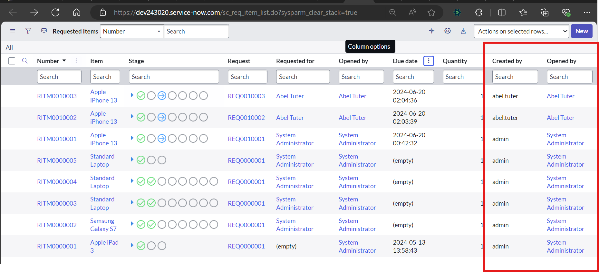
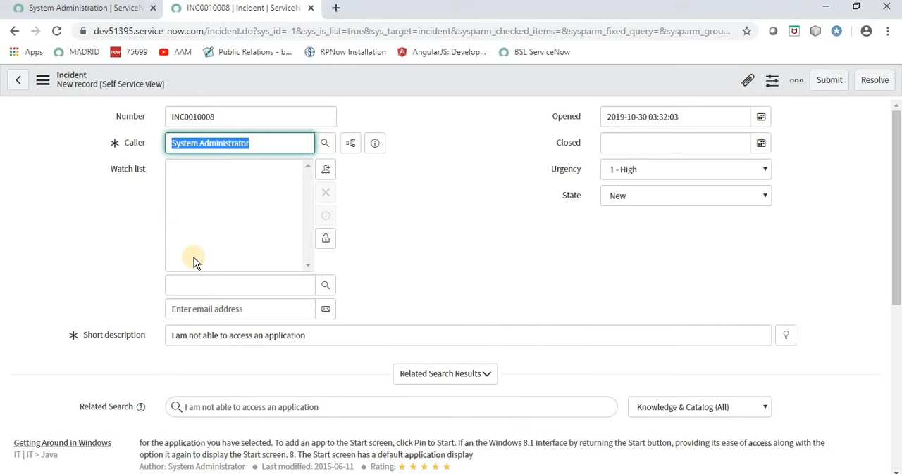
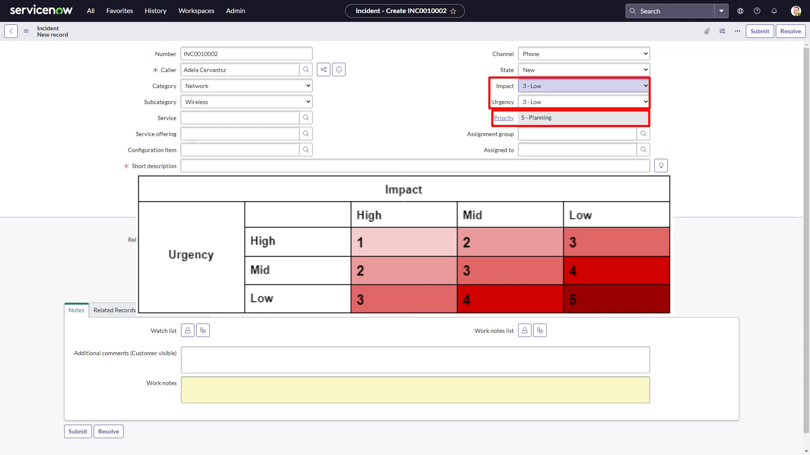
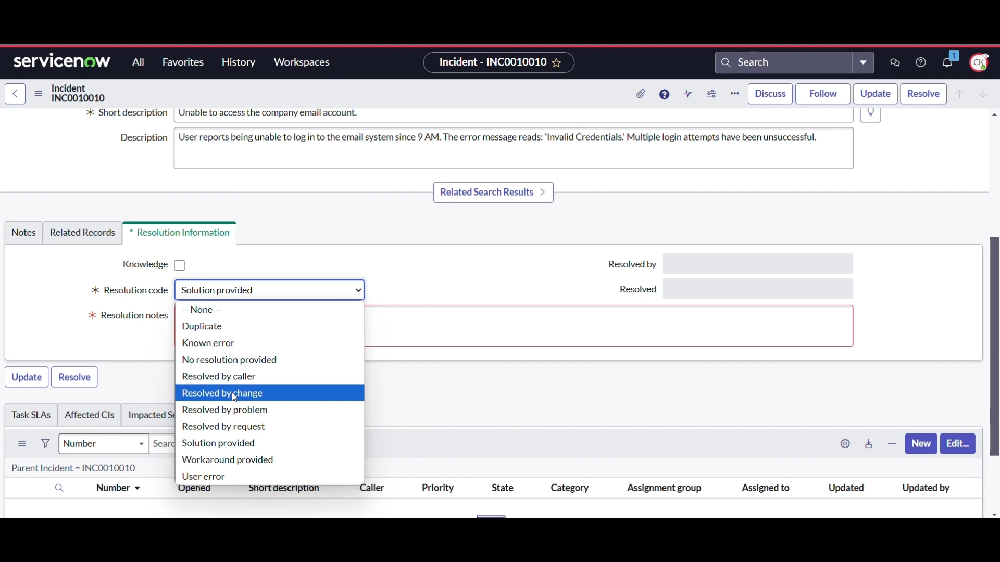
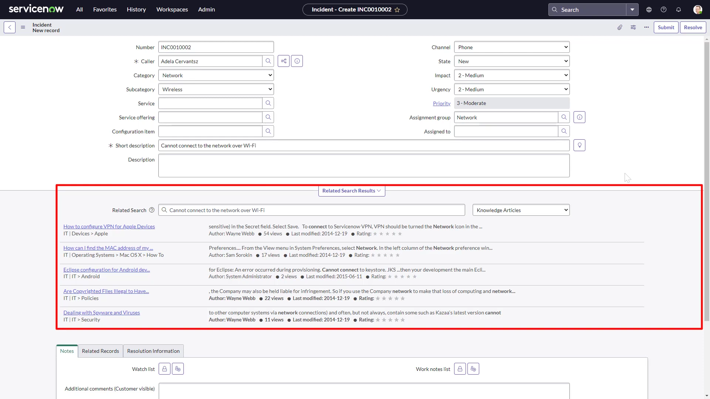
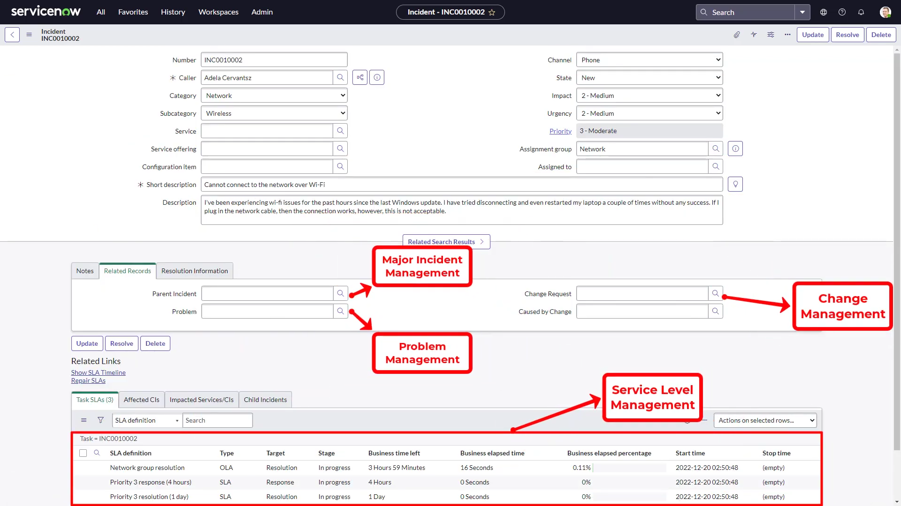
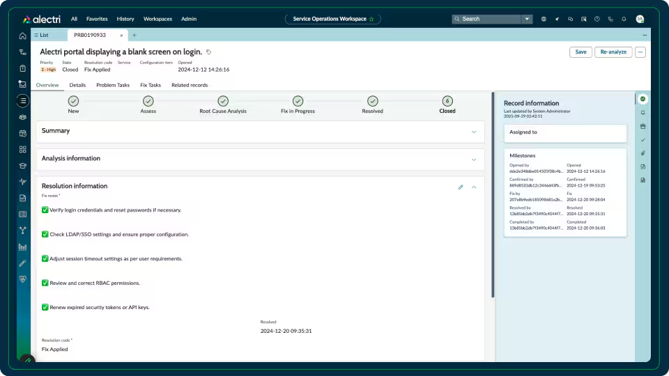
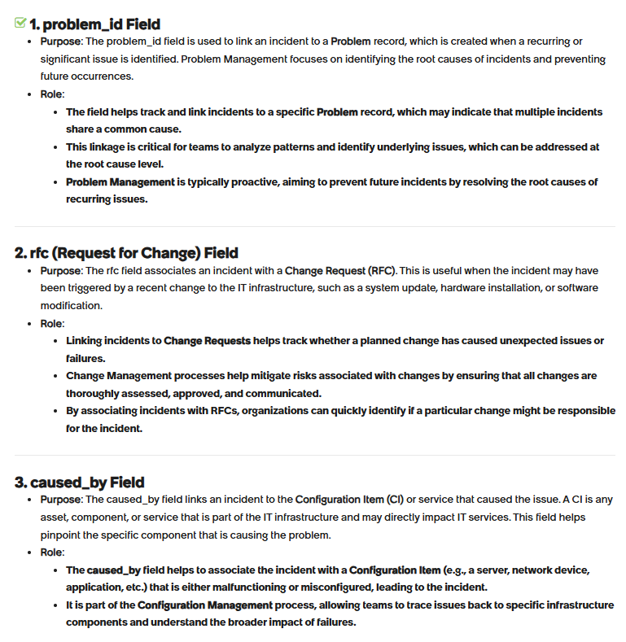
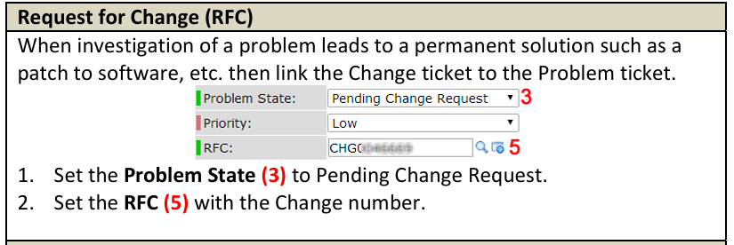

 Created_by fields captures the string value of user name. Whereas Opened_by is a reference field.

{https://www.servicenow.com/community/developer-forum/value-of-opened-by-is-not-matching-created-by/td-p/2966044/page/2}

Opened By is a reference field. Which means that if the user is deleted you have a sys_id but no record anymore.
— can differ if created via list view with a saved filter, an inbound email action, or a script/automation that sets it differently.
.
Created By is a string field. This means that no mather what happends with the record. This will stay as it is.
{https://www.reddit.com/r/servicenow/comments/e93p8r/opened_by_vs_created_by/}

---
priority is computed at servicenow backend using impact of incident (affect only 1 person/system or entire organization etc) & urgency user wish to select for the incident.

https://youtu.be/YRnB5W48svw?t=534
alternative- https://youtu.be/euYVzDzkG9A?t=285

Impact is only visible to service agent and not the end-user (certain IAM roles)

https://www.youtube.com/watch?v=vUda2Ywd3jU

---

Resolved by and resolved at are not mandatory fields

https://youtu.be/p1mgx3r5QNg?t=593

---

Knowledge articles

---

problem management contains a records of problems, if the incident (disruption) is related to known problem (root cause) in record

https://youtu.be/vUda2Ywd3jU?t=539

https://www.servicenow.com/products/problem-management.html#resources

---

rfc and caused_by are manually filled by the agent, while problem id is auto-fetched

https://www.servicenow.com/community/developer-forum/please-tell-me-about-the-roles-of-the-fields-problem-id-rfc-and/m-p/3149373

rfc is when solution for problem is identified in investigation, and its best practice to keep track of any changes in IT => **rfc**

https://it.ucsf.edu/sites/it.ucsf.edu/files/qrc_-_problem_management.pdf

https://youtu.be/1PPslt_nEd0?t=210